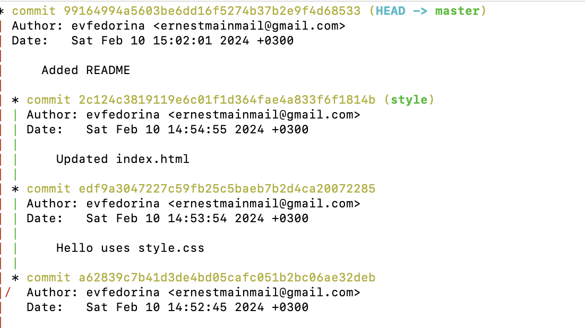

---
## Front matter
title: "Лабораторная работа №1"
subtitle: "Git и Markdown"
author: "Федорина Эрнест Васильевич"

## Generic otions
lang: ru-RU
toc-title: "Содержание"

## Bibliography
bibliography: bib/cite.bib
csl: pandoc/csl/gost-r-7-0-5-2008-numeric.csl

## Pdf output format
toc: true # Table of contents
toc-depth: 2
lof: true # List of figures
lot: true # List of tables
fontsize: 12pt
linestretch: 1.5
papersize: a4
documentclass: scrreprt
## I18n polyglossia
polyglossia-lang:
  name: russian
  options:
	- spelling=modern
	- babelshorthands=true
polyglossia-otherlangs:
  name: english
## I18n babel
babel-lang: russian
babel-otherlangs: english
## Fonts
mainfont: PT Serif
romanfont: PT Serif
sansfont: PT Sans
monofont: PT Mono
mainfontoptions: Ligatures=TeX
romanfontoptions: Ligatures=TeX
sansfontoptions: Ligatures=TeX,Scale=MatchLowercase
monofontoptions: Scale=MatchLowercase,Scale=0.9
## Biblatex
biblatex: true
biblio-style: "gost-numeric"
biblatexoptions:
  - parentracker=true
  - backend=biber
  - hyperref=auto
  - language=auto
  - autolang=other*
  - citestyle=gost-numeric
## Pandoc-crossref LaTeX customization
figureTitle: "Рис."
tableTitle: "Таблица"
listingTitle: "Листинг"
lofTitle: "Список иллюстраций"
lotTitle: "Список таблиц"
lolTitle: "Листинги"
## Misc options
indent: true
header-includes:
  - \usepackage{indentfirst}
  - \usepackage{float} # keep figures where there are in the text
  - \floatplacement{figure}{H} # keep figures where there are in the text
---

# Цель работы

Вспомнить, как работать с git,с командной строкой, изучить новые команды, заново научиться писать отчёты в markdown.

# Задание

1. Работа с GIT(навигация в ветках, их создание, слияние и удаление, создание, копирование репозитория, коммиты, индексация изменений и тд.)
2. Markdown(синтаксис, структура отчёта, работа с изображениями)

# Теоретическое введение

Git — система управления версиями с распределенной архитектурой. В отличие от некогда популярных систем вроде CVS и Subversion (SVN), где полная история версий проекта доступна лишь в одном месте, в Git каждая рабочая копия кода сама по себе является репозиторием. Это позволяет всем разработчикам хранить историю изменений в полном объеме.

Markdown — язык текстовой разметки, созданный писателем и блогером Джоном Грубером. Он предназначен для создания красиво оформленных текстов в обычных файлах формата TXT. Вам не нужны громоздкие процессоры вроде Word или Pages, чтобы создавать документы с жирным или курсивным начертанием, цитатами, ссылками и даже таблицами. Достаточно запомнить простые правила Markdown, и можно писать хоть в «Блокноте». Хотя специализированные Markdown-редакторы, конечно, намного удобнее.

# Выполнение лабораторной работы

##  GIT

Для начала мы ввели свои данные git, создали репозиторий, в котором сделали html файл.
Затем занимались тегированием, коммитили, отменяли изменения и тд. Далее поместили файл в в папку глубже данной и сделали так, чтобы в другой html файл передавался текст из предыдущего файла. Вот что получилось%

{ width=70% }

Затем меняли код и сделали ветку с названием style, потом связывали её и другую ветку.
Вот как выглядит версия style, здесь мы также коммитили разные изменения

{ width=70% }
{ width=70% }

Также меняли главную ветку master и смотрели логи

{ width=70% }

Далее мы решали конфликты, делали слияние, перебазирование веток и тд.
Например, здесь сделали слияние style в master и в логе увидели, что ветки теперь идентичны

{ width=70% }

В конце мы ещё немного поработали с репозиториями. Вот, например, результат клонирования репозитория "hello"

{ width=70% }

##  Markdown

Здесь покажу, что получилось в исходном коде отчёта для 1 лабораторной работы.
Это отчёт, который я как раз-таки пишу сейчас

{ width=70% }

# Выводы

Вспомнили основные команды для командной строки, создали репозиторий, скопировали его, также вносили в него разные изменения, коммитили их и тд. По итогу вспомнили, как работать с GIT, и командной строкой. Также путём написания данного отчёта, освежили память и поработали с редактором Markdown.

# Список литературы{.unnumbered}

::: {#refs}
:::