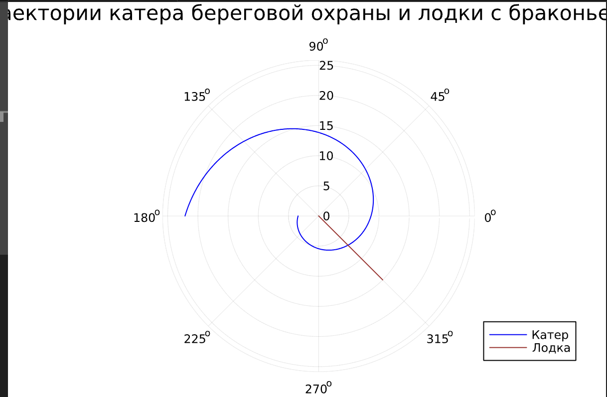
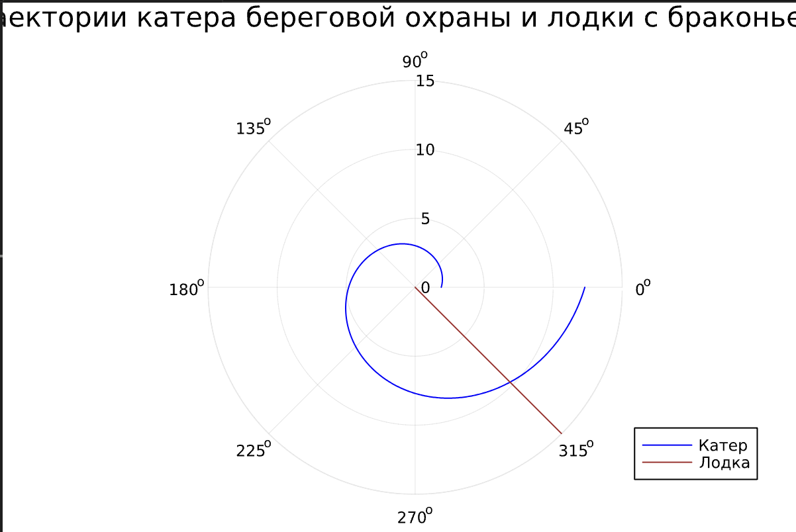

---
## Front matter
title: "Лабораторная работа №2"
subtitle: "Задача о погоне"
author: "Федорина Эрнест Васильевич"

## Generic otions
lang: ru-RU
toc-title: "Содержание"

## Bibliography
bibliography: bib/cite.bib
csl: pandoc/csl/gost-r-7-0-5-2008-numeric.csl

## Pdf output format
toc: true # Table of contents
toc-depth: 2
lof: true # List of figures
lot: true # List of tables
fontsize: 12pt
linestretch: 1.5
papersize: a4
documentclass: scrreprt
## I18n polyglossia
polyglossia-lang:
  name: russian
  options:
	- spelling=modern
	- babelshorthands=true
polyglossia-otherlangs:
  name: english
## I18n babel
babel-lang: russian
babel-otherlangs: english
## Fonts
mainfont: PT Serif
romanfont: PT Serif
sansfont: PT Sans
monofont: PT Mono
mainfontoptions: Ligatures=TeX
romanfontoptions: Ligatures=TeX
sansfontoptions: Ligatures=TeX,Scale=MatchLowercase
monofontoptions: Scale=MatchLowercase,Scale=0.9
## Biblatex
biblatex: true
biblio-style: "gost-numeric"
biblatexoptions:
  - parentracker=true
  - backend=biber
  - hyperref=auto
  - language=auto
  - autolang=other*
  - citestyle=gost-numeric
## Pandoc-crossref LaTeX customization
figureTitle: "Рис."
tableTitle: "Таблица"
listingTitle: "Листинг"
lofTitle: "Список иллюстраций"
lotTitle: "Список таблиц"
lolTitle: "Листинги"
## Misc options
indent: true
header-includes:
  - \usepackage{indentfirst}
  - \usepackage{float} # keep figures where there are in the text
  - \floatplacement{figure}{H} # keep figures where there are in the text
---

# Цель работы

Построить такую математическую модель, которая будет решать задачу о погоне на воде.

# Задание

Вариант 4
На море в тумане катер береговой охраны преследует лодку браконьеров.
Через определенный промежуток времени туман рассеивается, и лодка
обнаруживается на расстоянии 8,5 км от катера. Затем лодка снова скрывается в
тумане и уходит прямолинейно в неизвестном направлении. Известно, что скорость
катера в 3,5 раза больше скорости браконьерской лодки.
1. Запишите уравнение, описывающее движение катера, с начальными
условиями для двух случаев (в зависимости от расположения катера
относительно лодки в начальный момент времени).
2. Постройте траекторию движения катера и лодки для двух случаев.
3. Найдите точку пересечения траектории катера и лодки 

# Теоретическое введение

Математи́ческая моде́ль — математическое представление реальности, один из вариантов модели как системы, исследование которой позволяет получать информацию о некоторой другой системе. Математическая модель, в частности, предназначена для прогнозирования поведения реального объекта, но всегда представляет собой ту или иную степень его идеализации
Математи́ческим моделированием называют как саму деятельность, так и совокупность принятых приёмов и техник построения и изучения математических моделей.
# Выполнение лабораторной работы

##  Уравнение, описывающее движение

Расстояние можно найти по формуле:
x/v=k-x/3.5v - в первом случае и x/v=k+x/3.5v - во втором случае.
Поитогу у меня получилось, что x1 = 8.5/4.5, x2= 8.5/2.5

##  Траектории

Написал следующий код:

using DifferentialEquations
using Plots

s = 8.5
fi = 3pi/4

function guardboat!(du,u)
    du[1] = u[1] / sqrt(11.25) 
end

r0 = [s/4.5]
span = (0, 2pi)

prob = ODEProblem(guardboat!, r0, span)
sol = solve(prob, Tsit5(), saveat=0.01)
f1(t) = tan(fi)*t
t = 0:0.01:15
p = Plots.plot(proj=:polar, legend=:bottomright, title="Траектории катера береговой охраны и лодки с браконьерами")
plot!(sol.t, getindex.(sol.u, 1), color=:blue, label="Катер")
plot!(fill(fi, length(t)), f1.(t), color=:brown, label="Лодка")
display(p)

В нём я написал несколько функций для вычисления траекторий, а также, используя DifferentialEquations решил задачу Коши для обоих случаев(в представленном коде только один из них, второй аналогичный, только с другими цифрами)
Также, используя Plots я построил траектории движения катера и лодки.

Вот так выглядит первый случай
{ width=70% }

А так - второй
{ width=70% }

Также нашли точку пересечения траектории катера и лодки.

# Выводы

Написали математическую модель, решили задачу о погоне, а также познакомились с языком программирования Julia.

# Список литературы{.unnumbered}

::: {#refs}
https://ru.wikipedia.org/wiki/%D0%9C%D0%B0%D1%82%D0%B5%D0%BC%D0%B0%D1%82%D0%B8%D1%87%D0%B5%D1%81%D0%BA%D0%B0%D1%8F_%D0%BC%D0%BE%D0%B4%D0%B5%D0%BB%D1%8C
:::