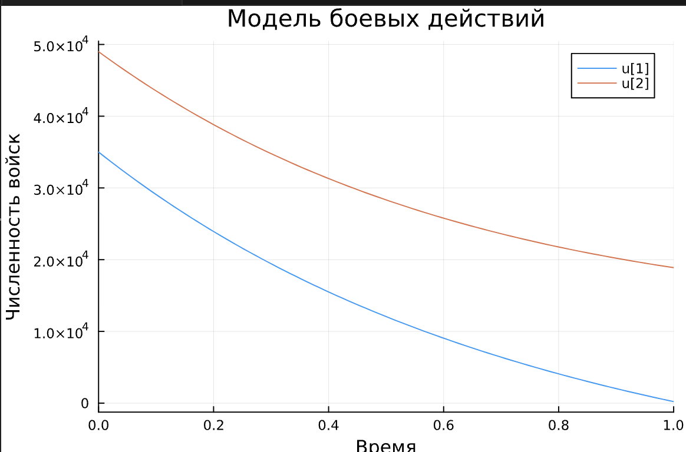
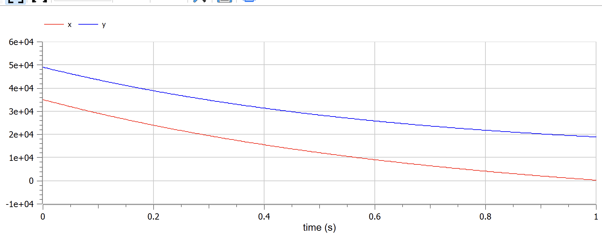
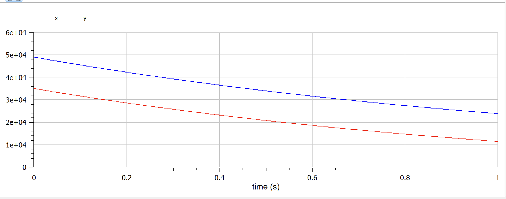

---
## Front matter
title: "Лабораторная работа №3"
subtitle: "Модель боевых действий"
author: "Федорина Эрнест Васильевич"

## Generic otions
lang: ru-RU
toc-title: "Содержание"

## Bibliography
bibliography: bib/cite.bib
csl: pandoc/csl/gost-r-7-0-5-2008-numeric.csl

## Pdf output format
toc: true # Table of contents
toc-depth: 2
lof: true # List of figures
lot: true # List of tables
fontsize: 12pt
linestretch: 1.5
papersize: a4
documentclass: scrreprt
## I18n polyglossia
polyglossia-lang:
  name: russian
  options:
	- spelling=modern
	- babelshorthands=true
polyglossia-otherlangs:
  name: english
## I18n babel
babel-lang: russian
babel-otherlangs: english
## Fonts
mainfont: PT Serif
romanfont: PT Serif
sansfont: PT Sans
monofont: PT Mono
mainfontoptions: Ligatures=TeX
romanfontoptions: Ligatures=TeX
sansfontoptions: Ligatures=TeX,Scale=MatchLowercase
monofontoptions: Scale=MatchLowercase,Scale=0.9
## Biblatex
biblatex: true
biblio-style: "gost-numeric"
biblatexoptions:
  - parentracker=true
  - backend=biber
  - hyperref=auto
  - language=auto
  - autolang=other*
  - citestyle=gost-numeric
## Pandoc-crossref LaTeX customization
figureTitle: "Рис."
tableTitle: "Таблица"
listingTitle: "Листинг"
lofTitle: "Список иллюстраций"
lotTitle: "Список таблиц"
lolTitle: "Листинги"
## Misc options
indent: true
header-includes:
  - \usepackage{indentfirst}
  - \usepackage{float} # keep figures where there are in the text
  - \floatplacement{figure}{H} # keep figures where there are in the text
---

# Цель работы

Построить такую математическую модель, которая будет решать задачу изменения состава войск в армиях X и Y.


# Задание

Вариант 4

Между страной Х и страной У идет война. Численность состава войск
исчисляется от начала войны, и являются временными функциями
x(t)
и
y(t).
В начальный момент времени страна Х имеет армию численностью 35 000 человек, а
в распоряжении страны У армия численностью в 49 000 человек. Для упрощения
модели считаем, что коэффициенты
a, b, c, h постоянны. Также считаем
P(t) и Q(t) - непрерывные функции.

Постройте графики изменения численности войск армии Х и армии У для
следующих случаев:
1. Модель боевых действий между регулярными войсками
2. Модель ведение боевых действий с участием регулярных войск и
партизанских отрядов

# Теоретическое введение

Математи́ческая моде́ль — математическое представление реальности, один из вариантов модели как системы, исследование которой позволяет получать информацию о некоторой другой системе. Математическая модель, в частности, предназначена для прогнозирования поведения реального объекта, но всегда представляет собой ту или иную степень его идеализации
Математи́ческим моделированием называют как саму деятельность, так и совокупность принятых приёмов и техник построения и изучения математических моделей.

# Выполнение лабораторной работы

##  Создание моделей и объяснения кода

Суть задачи в том, чтобы решать системы дифф. уравнений(которые, в свою очередь являются моделями изменения численности войска одной из армий, на которую влияют коэффициенты(факторы, влияющие на потери) на каждом шаге и строить точки на графике, пока одна из армий не опустеет.

Написал следующий код для решения задачи с помощью языка Julia:

```
using Plots
using DifferentialEquations
init_x = 35000
init_y = 49000
start_time = 0
end_time = 1

a1 = 0.55
b1 = 0.9
c1 = 0.8
h1 = 0.63

a2 = 0.35
b2 = 0.46
c2 = 0.2
h2 = 0.6

function P1(t)
    2*abs(sin(t))
end

function Q1(t)
    cos(13t) + 1
end


function P2(t)
    1.5*abs(sin(2*t))
end

function Q2(t)
    cos(0.5*t) + 1
end

function system1(derivatives, y, params, time)
    derivatives[1] = -a1*y[1] - b1*y[2] + P1(time)
    derivatives[2] = -c1*y[1] - h1*y[2] + Q1(time)
end

function system2(derivatives, y, params, time)
    derivatives[1] = -a2*y[1] - b2*y[2] + P2(time)
    derivatives[2] = -c2*y[1] - h2*y[2] + Q2(time)
end

init_cond = [init_x; init_y]
time_span = (start_time, end_time)
time_point = collect(LinRange(start_time,end_time,100))

problem1 = ODEProblem(system1, init_cond, time_span)
sol1 = solve(problem1, saveat=time_points)

problem2 = ODEProblem(system2, init_cond, time_span)
sol2 = solve(problem2, saveat=time_points)

plot(sol2, title="Модель боевых действий", xlabel="Время", ylabel="Численность войск")

```

В первую очередь, мы задали определённые коэффициенты, постоянные, которые влияют на численность войск, затем из дифф. уравнений обеих армий составили системы.

```
function system1(derivatives, y, params, time)
    derivatives[1] = -a1*y[1] - b1*y[2] + P1(time)
    derivatives[2] = -c1*y[1] - h1*y[2] + Q1(time)
end

function system2(derivatives, y, params, time)
    derivatives[1] = -a2*y[1] - b2*y[2] + P2(time)
    derivatives[2] = -c2*y[1] - h2*y[2] + Q2(time)
end
```

Затем ввели необходимые ограничения, периоды, шаги и с помощью пакета DifferentialEquations решили системы для обоих случаев(с партизанскими отрядами и без):
```
problem1 = ODEProblem(system1, init_cond, time_span)
sol1 = solve(problem1, saveat=time_points)

problem2 = ODEProblem(system2, init_cond, time_span)
sol2 = solve(problem2, saveat=time_points)
```
Вот так выглядит первый случай
{ width=70% }
рис.1

А так - второй
{ width=70% }
рис.2

Видно, что вторая армия(Y) побеждает в любой ситуации.

Далее я написал следующий код для решения задачи с помощью OpenModelica:

```
model lab_3
Real x;
Real y;
parameter Real a1 = 0.55;
parameter Real b1 = 0.9;
parameter Real c1 = 0.8;
parameter Real h1 = 0.63;

parameter Real a2 = 0.35;
parameter Real b2 = 0.46;
parameter Real c2 = 0.2;
parameter Real h2 = 0.6;

initial equation
  x = 35000;
  y = 49000;
equation
  der(x)= -a2*x - b2*y + 1.5*abs(sin(2*time));
  der(y)= -c2*x - h2*y + cos(0.5*time) + 1;

end lab_3;
```

В нём я задал нужные нам коэффициенты, затем записал две функции в equation, а ранее - начальные x и y - численности армий в initial equation.
Затем начал симуляцию модели и вот, что получилось

Вот так выглядит первый случай
{ width=70% }
рис.3

А так - второй
{ width=70% }
рис.4
Также нашли точку пересечения траектории катера и лодки.

# Выводы

Написали математическую модель(на двух языках - Julia и OpenModelica, связанную с изменением численности войск, на которые влияют различные факторы(коэффициенты или функции), определили, какая армия закончится быстрее, а также познакомились с языком программирования OpenModelica, вспомнили Julia.

# Список литературы{.unnumbered}

:::
{#refs}
:::