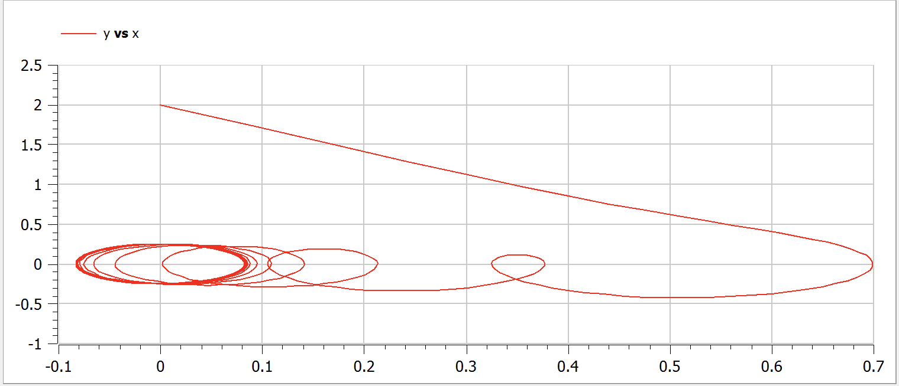

---
## Front matter
title: "Лабораторная работа №4"
subtitle: "Модель гармонических колебаний"
author: "Федорина Эрнест Васильевич"

## Generic otions
lang: ru-RU
toc-title: "Содержание"

## Bibliography
bibliography: bib/cite.bib
csl: pandoc/csl/gost-r-7-0-5-2008-numeric.csl

## Pdf output format
toc: true # Table of contents
toc-depth: 2
lof: true # List of figures
lot: false # List of tables
fontsize: 12pt
linestretch: 1.5
papersize: a4
documentclass: scrreprt
## I18n polyglossia
polyglossia-lang:
  name: russian
  options:
	- spelling=modern
	- babelshorthands=true
polyglossia-otherlangs:
  name: english
## I18n babel
babel-lang: russian
babel-otherlangs: english
## Fonts
mainfont: PT Serif
romanfont: PT Serif
sansfont: PT Sans
monofont: PT Mono
mainfontoptions: Ligatures=TeX
romanfontoptions: Ligatures=TeX
sansfontoptions: Ligatures=TeX,Scale=MatchLowercase
monofontoptions: Scale=MatchLowercase,Scale=0.9
## Biblatex
biblatex: true
biblio-style: "gost-numeric"
biblatexoptions:
  - parentracker=true
  - backend=biber
  - hyperref=auto
  - language=auto
  - autolang=other*
  - citestyle=gost-numeric
## Pandoc-crossref LaTeX customization
figureTitle: "Рис."
tableTitle: "Таблица"
listingTitle: "Листинг"
lofTitle: "Список иллюстраций"
lotTitle: "Список таблиц"
lolTitle: "Листинги"
## Misc options
indent: true
header-includes:
  - \usepackage{indentfirst}
  - \usepackage{float} # keep figures where there are in the text
  - \floatplacement{figure}{H} # keep figures where there are in the text
---

# Цель работы

Научиться строить фазовый портрет, вспомнить Julia и OpenModelica, вспомнить теорию для построения фазовых портретов, а также научиться создавать модели гармонических колебаний

# Задание

Вариант № 4
Постройте фазовый портрет гармонического осциллятора и решение уравнения
гармонического осциллятора для следующих случаев 
1. Колебания гармонического осциллятора без затуханий и без действий внешней
силы
x''+15x=0
2. Колебания гармонического осциллятора c затуханием и без действий внешней
силы
x''+10x'+x=0
3. Колебания гармонического осциллятора c затуханием и под действием внешней
силы
x''+3x'+x=sin(3t)
На интервале
t = от 0 до 55;
(шаг 0.05) с начальными условиями
x0 = 0, y0= 2


# Теоретическое введение

Фазовый портрет исследуемой системы — это совокупность фазовых траекторий для всевозможных начальных условий. Его можно рассматривать как интегральное многообразие.

Поскольку при изучении поведения системы интересуются прежде всего стационарными движениями в системе,то фазовый портрет можно также рассматривать как разбиение фазового пространства на области притяжения стационарных решений.

Классификацию характера особых точек системы уравнений можно провести на основании особенностей фазового портрета, поскольку как минимум для некоторых систем каждая особая точка системы дифференциальных уравнений является также и особой точкой в смысле, употребляемом в дифференциальной геометрии.

Ф.п. обычно как-то деформируется при изменении параметров системы. Качественному изменению ф.п. соответствует исчезновение существующих и рождение новых стационарных решений, — и такое изменение ф.п. называют бифуркационной ситуацией.[@wiki:bash].

# Выполнение лабораторной работы

## Модель боевых действий между регулярными войсками

Рассмотрим последний случай, так как он более показательный:

x''+3x'+x=sin(3t) - Уравнение свободных колебаний гармонического осцилляторa,
где x – переменная, описывающая состояние системы (смещение грузика, заряд
конденсатора и т.д.), &gamma = 3 – параметр, характеризующий потери энергии (трение в
механической системе, сопротивление в контуре), &Omega = 1
– собственная частота
колебаний, t – время

Для начала построим эту модель на Julia(в коде представлен 3 случай):


```
using Plots
using DifferentialEquations

const x0 = 0
const y0 = 2
const omega = 1
const gamma = 3
p = (omega)
p2 = (omega, gamma)
P(t) = sin(3t)
T = (0, 55)
u0 = [x0, y0]
function FF(du, u, p, t)
    omega, gamma = p
    du[1] = u[2]
    du[2] = P(t) - gamma*du[1] - omega*u[1]
end

prob = ODEProblem(FF, u0, T, p2)
solution = solve(prob, dtmax=0.05)

plt = plot(solution, vars=(2,1), color=:purple, label="Фаз.Портрет", title="Случай №1", xlabel="Ось X", ylabel="Ось Y")
plt2 = plot(solution, vars=(0,1), color=:red, label="x(t)", title="Случай №1", xlabel="t, sec")
plot!(plt2, solution, vars=(0,2), color=:brown, label="y(t)")

savefig(plt,"julia_3sl_1p")
savefig(plt2,"julia_3sl_2p")
```

Теперь давайте построим эту же модель с помощью OpenModelica.

Задаем параметры, начальные условия, определяем систему уравнений и выполняем симуляцию этой модели.

```OpenModelica
model lab4_test
parameter Real x0 = 0;
parameter Real y0 = 2;
parameter Real omega = 1;
parameter Real gamma = 3;
Real P;
Real x(start=x0);
Real y(start=y0);
equation
P = sin(3*time);
der(x) = y;
der(y) = P-gamma*der(x)-omega*x;
end lab4_test;
```

Всё что меняется в коде - это мы убираем член P(t) и меняем коэффициенты.


В первом случае(уравнение x''+15x=0) получаем фазовый портрет, а также графическое решение системы ДУ, где по оси t - время: (рис. [-@fig:001], [-@fig:002], [-@fig:007], [-@fig:008]):

{#fig:001 width=70%}

{#fig:007 width=70%}

{#fig:002 width=70%}

{#fig:008 width=70%}

Всё что меняется в коде - это мы убираем член P(t) и меняем коэффициенты.
Данное уравнение в первом случае называется уравнением консервативного осциллятора энергия колебания которого сохраняется во времени. То есть здесь на движение влияет только собственная частота колебаний, без внешних воздействий


Во втором случае(уравнение x''+10x'+x=0) видим, что появляется &gamma = 10, а значит - это уравнение колебания гармонического осциллятора c затуханием и без действий внешней
силы : (рис. [-@fig:003], [-@fig:004], [-@fig:009], [-@fig:010]):

{#fig:003 width=70%}

{#fig:009 width=70%}

{#fig:004 width=70%}

{#fig:010 width=70%}

Во третьем случае(уравнение x''+3x'+x=sin(3t)) видим, что появляется синус, а значит теперь это уравнение колебания гармонического осциллятора c затуханием и под действием внешней силы : (рис. [-@fig:005], [-@fig:006], [-@fig:011], [-@fig:012]):

{#fig:005 width=70%}

{#fig:011 width=70%}

{#fig:006 width=70%}

{#fig:012 width=70%}


Сравнивая графики, полученные в Julia и OpenModelica, разницы особой незаметно(разве что масштаб), значит мы всё сделали правильно!

# Выводы

В процессе выполнения данной лабораторной работы я построил модель гармонических колебаний на языке прогаммирования Julia и посредством ПО OpenModelica, а также провел сравнительный анализ их результатов.

# Список литературы{.unnumbered}

::: {#refs}
:::
