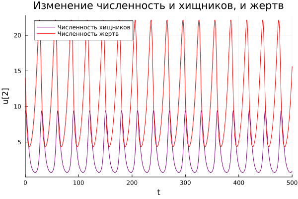
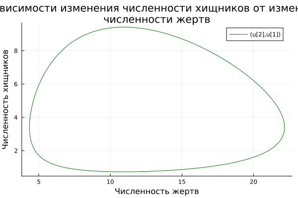
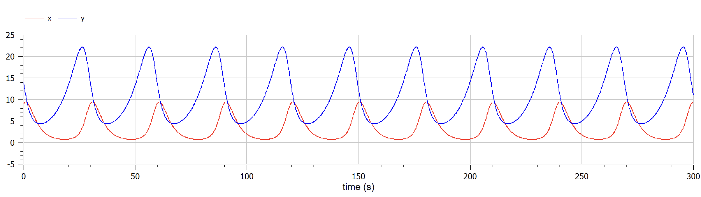
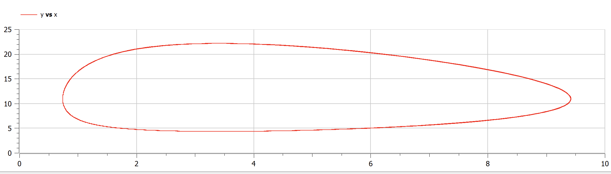

---
## Front matter
title: "Лабораторная работа №5"
subtitle: "Модель хищник-жертва"
author: "Федорина Эрнест Васильевич"

## Generic otions
lang: ru-RU
toc-title: "Содержание"

## Bibliography
bibliography: bib/cite.bib
csl: pandoc/csl/gost-r-7-0-5-2008-numeric.csl

## Pdf output format
toc: true # Table of contents
toc-depth: 2
lof: true # List of figures
lot: false # List of tables
fontsize: 12pt
linestretch: 1.5
papersize: a4
documentclass: scrreprt
## I18n polyglossia
polyglossia-lang:
  name: russian
  options:
	- spelling=modern
	- babelshorthands=true
polyglossia-otherlangs:
  name: english
## I18n babel
babel-lang: russian
babel-otherlangs: english
## Fonts
mainfont: PT Serif
romanfont: PT Serif
sansfont: PT Sans
monofont: PT Mono
mainfontoptions: Ligatures=TeX
romanfontoptions: Ligatures=TeX
sansfontoptions: Ligatures=TeX,Scale=MatchLowercase
monofontoptions: Scale=MatchLowercase,Scale=0.9
## Biblatex
biblatex: true
biblio-style: "gost-numeric"
biblatexoptions:
  - parentracker=true
  - backend=biber
  - hyperref=auto
  - language=auto
  - autolang=other*
  - citestyle=gost-numeric
## Pandoc-crossref LaTeX customization
figureTitle: "Рис."
tableTitle: "Таблица"
listingTitle: "Листинг"
lofTitle: "Список иллюстраций"
lotTitle: "Список таблиц"
lolTitle: "Листинги"
## Misc options
indent: true
header-includes:
  - \usepackage{indentfirst}
  - \usepackage{float} # keep figures where there are in the text
  - \floatplacement{figure}{H} # keep figures where there are in the text
---

# Цель работы

Научиться строить базовую модель Хищник-жертва в Julia, OpenModelica

# Задание

Вариант 4
Для модели «хищник-жертва»:
$\frac{\partial x}{\partial t} = -0.15x +  0.044xy$

$\frac{\partial y}{\partial t} = 0.35y -  0.032xy)$

Постройте график зависимости численности хищников от численности жертв,
а также графики изменения численности хищников и численности жертв при
следующих начальных условиях:
x0 = 9, y0 = 14

Найдите стационарное
состояние системы

# Теоретическое введение

МОДЕЛИ ВЗАИМОДЕЙСТВИЯ ДВУХ ВИДОВ
 

Гипотезы Вольтерра. Аналогии с химической кинетикой. Вольтерровские модели взаимодействий. Классификация типов взаимодействий Конкуренция. Хищник-жертва. Обобщенные модели взаимодействия видов. Модель Колмогорова. Модель взаимодействия двух видов насекомых Макартура. Параметрический и фазовые портреты системы Базыкина.

Основателем современной математической теории популяций справедливо считается итальянский математик Вито Вольтерра, разработавший математическую теорию биологических сообществ, аппаратом которой служат дифференциальные и интегро-дифференциальные уравнения. (Vito Volterra. Lecons sur la Theorie Mathematique de la Lutte pour la Vie. Paris, 1931). В последующие десятилетия популяционная динамика развивалась, в основном, в русле высказанных в этой книге идей. Русский перевод книги Вольтерра вышел в 1976 г. под названием: «Математическая теория борьбы за существование» с послесловием Ю.М. Свирежева, в котором рассматривается история развития математической экологии в период 1931‑1976 гг.

Книга Вольтерра написана так, как пишут книги по математике. В ней сначала сформулированы некоторые предположения о математических объектах, которые предполагается изучать, а затем проводится математическое исследование свойств этих объектов.

Системы, изученные Вольтерра, состоят их двух или нескольких видов. В отдельных случаях рассматривается запас используемой пищи. В основу уравнений, описывающих взаимодействие этих видов, положены следующие представления.

 
Гипотезы Вольтерра

1. Пища либо имеется в неограниченном количестве, либо ее поступление с течением времени жестко регламентировано.

2. Особи каждого вида отмирают так, что в единицу времени погибает постоянная доля существующих особей.

3. Хищные виды поедают жертв, причем в единицу времени количество съеденных жертв всегда пропорционально вероятности встречи особей этих двух видов, т.е. произведению количества хищников на количество жертв.

4. Если имеется пища в ограниченном количестве и несколько видов, которые способны ее потреблять, то доля пищи, потребляемой видом в единицу времени, пропорциональна количеству особей этого вида, взятому с некоторым коэффициентом, зависящим от вида (модели межвидовой конкуренции).

5. Если вид питается пищей, имеющейся в неограниченном количестве, прирост численности вида в единицу времени пропорционален численности вида.

6. Если вид питается пищей, имеющейся в ограниченном количестве, то его размножение регулируется скоростью потребления пищи, т.е. за единицу времени прирост пропорционален количеству съеденной пищи.[@wiki:bash].

# Выполнение лабораторной работы

## Строим модели

В этой модели x – число жертв, y - число хищников. Коэффициент a
описывает скорость естественного прироста числа жертв в отсутствие хищников, с
- естественное вымирание хищников, лишенных пищи в виде жертв. Вероятность
взаимодействия жертвы и хищника считается пропорциональной как количеству
жертв, так и числу самих хищников (xy). Каждый акт взаимодействия уменьшает
популяцию жертв, но способствует увеличению популяции хищников (члены -bxy
и dxy в правой части уравнения). 

Для начала построим эту модель на Julia:


```
using Plots
using DifferentialEquations
const x0 = 9
const y0 = 14
const a = 0.15
const b = 0.044
const c = 0.35
const d = 0.032

T = (0,500)
nach = [x0, y0]
p = (a, b, c, d)
function F(du, u, p, t)
    a, b, c, d = p
    du[1] = -c*u[1] + d*u[1]*u[2]
    du[2] = a*u[2] - b*u[1]*u[2]
end
pr = ODEProblem(F, nach, T, p)
solution = solve(pr, dtmax=0.1)
plt = plot(solution, vars=(2, 1), color=:green, title="Зависимости изменения численности хищников от изменения
численности жертв", xlabel = "Численность жертв", ylabel = "Численность хищников")
plt2 = plot(solution, vars=(0, 1), color=:purple, label="Численность хищников", title="Изменение численность и хищников, и жертв", xlabel="t")
plot!(plt2, solution, vars=(0, 2), color=:red, label="Численность жертв")
savefig(plt, "j1.png")
savefig(plt2, "j2.png")
```
Здесь всё достаточно просто: мы завели все нужные коэффициенты, начальные условия, составили систему дифф. уравнений, решили её с помощью DifferentialEquations, а потом построили график зависимости x(t) и y(t) - динамика популяций жертв и хищников, соответственно(рис. [-@fig:001].

{#fig:001 width=70%}

Затем мы построили фазовый портрет, или же график зависимости численности хищников от численности жертв(рис. [-@fig:002].

{#fig:002 width=70%}

Теперь давайте построим эту же модель с помощью OpenModelica.

Задаем параметры, начальные условия, определяем систему уравнений и выполняем симуляцию этой модели.

```OpenModelica
model lab5
parameter Integer x0 = 9;
parameter Integer y0 = 14;
parameter Real a = 0.15;
parameter Real b = 0.044;
parameter Real c = 0.35;
parameter Real d = 0.032;
Real x(start=x0);
Real y(start=y0);
equation
der(x) = -c*x + d*x*y;
der(y) = a*y - b*x*y;
end lab5;
```

В данном ПО всё ещё проще: Задаём нач. условия, записываем два дифф. уравнения, настраиваем симуляцию и запускаем её, после чего получаем два графика(рис. [-@fig:003],[-@fig:004].)

{#fig:003 width=70%}

{#fig:004 width=70%}


Сравнивая графики, полученные в Julia и OpenModelica, разницы особой незаметно(разве что масштаб), значит мы всё сделали правильно!

Стационарное состояние системы (1) (положение равновесия, не зависящее
от времени решение) будет в точке: x0 = c/d, y0 = a/b
Наши стационарные точки: x0 = 3.4, y0 = 10.9
# Выводы

В процессе выполнения данной лабораторной работы я построил модель хищник-жертва на языке прогаммирования Julia и посредством ПО OpenModelica, а также провел сравнительный анализ их результатов.

# Список литературы{.unnumbered}

::: {#refs}
:::
