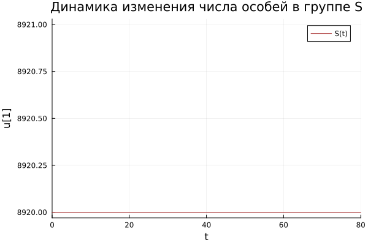
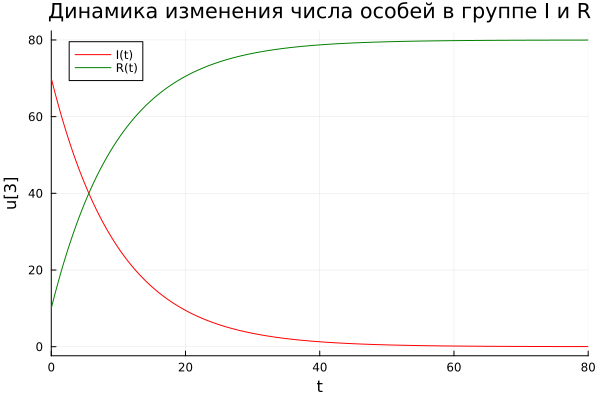
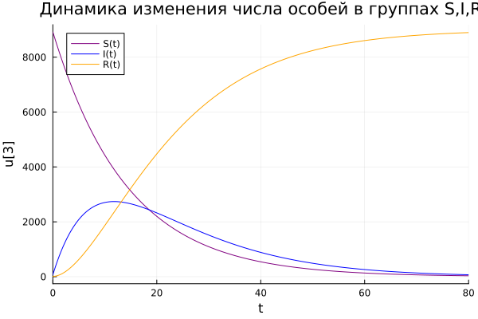
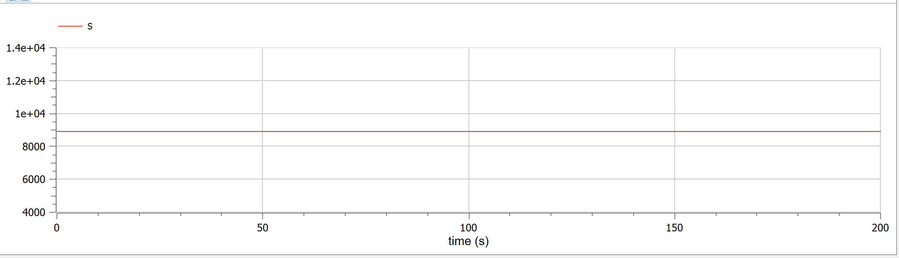
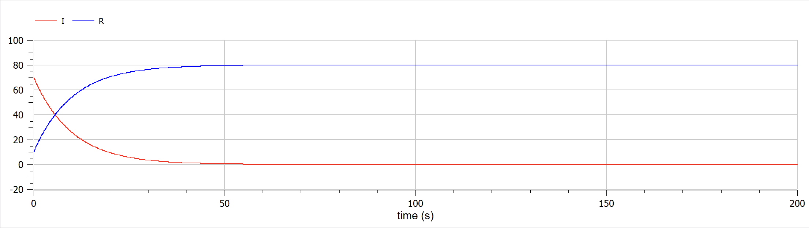
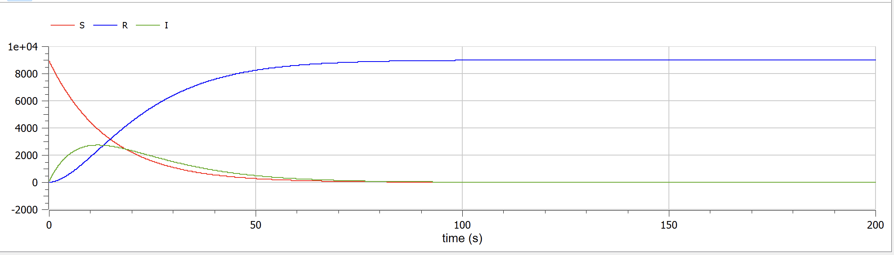

---
## Front matter
lang: ru-RU
title: Лабораторная работа №6
subtitle: Задача об эпидемии
author:
  - Федорина Эрнест Васильевич
institute:
  - Российский университет дружбы народов, Москва, Россия

## i18n babel
babel-lang: russian
babel-otherlangs: english

## Formatting pdf
toc: false
toc-title: Содержание
slide_level: 2
aspectratio: 169
section-titles: true
theme: metropolis
header-includes:
 - \metroset{progressbar=frametitle,sectionpage=progressbar,numbering=fraction}
 - '\makeatletter'
 - '\beamer@ignorenonframefalse'
 - '\makeatother'
---

# Информация

## Докладчик

:::::::::::::: {.columns align=center}
::: {.column width="70%"}

  * Федорина Эрнест Васильевич
  * студент
  * Российский университет дружбы народов
  * [1032216454@pfur.ru](mailto:1032216454@pfur.ru)
  * <https://evfedorina.github.io/ru/>

:::
::: {.column width="25%"}

:::
::::::::::::::

## Цель работы

Научиться строить базовую модель распространения эпидемии в Julia, OpenModelica

## Задание

На одном острове вспыхнула эпидемия. Известно, что из всех проживающих
на острове (N=9000) в момент начала эпидемии (t=0) число заболевших людей
(являющихся распространителями инфекции) I(0)=70, А число здоровых людей с
иммунитетом к болезни R(0)=10. Таким образом, число людей восприимчивых к
болезни, но пока здоровых, в начальный момент времени S(0)=N-I(0)- R(0).
Постройте графики изменения числа особей в каждой из трех групп.
Рассмотрите, как будет протекать эпидемия в случае:

1) если I(0) <= I*
2) если I(0) > I*

# Ход работы:

## Строим модели

Для начала построим эту модель на Julia

## 1 случай  Julia -  I(0) <= I*

Случай, в котором все инфицированные изолированы от тех, кто может заболеть и никто новый не заражается:

Здесь всё достаточно просто: мы завели все нужные коэффициенты, начальные условия, составили систему дифф. уравнений, решили её с помощью DifferentialEquations, а потом построили графики изменения популяций групп S, I, R(рис. [-@fig:001],[-@fig:002].

## 1 случай  Julia -  I(0) <= I*

{#fig:001 width=70%}

## 1 случай  Julia -  I(0) <= I*

{#fig:002 width=70%}

## 2 случай Julia -  I(0) > I*

Случай, в котором все инфицированные уже не изолированы от тех, кто может заболеть и люди, подверженные заражению, постепенно заражаются:(рис. [-@fig:003].)

## 2 случай Julia -  I(0) > I*

{#fig:003 width=70%}

## OpenModelica

Теперь давайте построим эту же модель с помощью OpenModelica.

Задаем параметры, начальные условия, определяем систему уравнений и выполняем симуляцию этой модели.

## 1 случай OpenModelica -  I(0) <= I*

В данном ПО всё ещё проще: Задаём нач. условия, записываем два дифф. уравнения, настраиваем симуляцию и запускаем её, после чего получаем два графика(рис. [-@fig:004],[-@fig:005].)

## 1 случай OpenModelica -  I(0) <= I*

{#fig:004 width=70%}

## 1 случай OpenModelica -  I(0) <= I*

{#fig:005 width=70%}

## 2 случай OpenModelica -  I(0) > I*

Случай, в котором все инфицированные уже не изолированы от тех, кто может заболеть и люди, подверженные заражению, постепенно заражаются:(рис. [-@fig:006].)

## 2 случай OpenModelica -  I(0) > I*

{#fig:003 width=70%}

## Сравнение графиков

Сравнивая графики, полученные в Julia и OpenModelica, разницы особой незаметно(разве что масштаб), значит мы всё сделали правильно: Во втором случае, например, люди, подверженные заражению - в динамике они болеют и их число уменьшается, значит увеличивается число инфицированных, а число особей с иммунитетом тоже увеличивается( т.к люди  выздоравливают и получают иммунитет).

## Результат

В результате мы построили графики с изменением числа особей трёх вышеобозначенных групп в рамках пандемии. Сравнили решения обоих ПО.

## Выводы

В процессе выполнения данной лабораторной работы я построил модель развития эпидемии на языке прогаммирования Julia и посредством ПО OpenModelica, а также провел сравнительный анализ их результатов.

## Список литературы

1. Задача об эпидемии [Электронный ресурс]. URL: https://futurepubl.ru/ru/nauka/article/37206/view