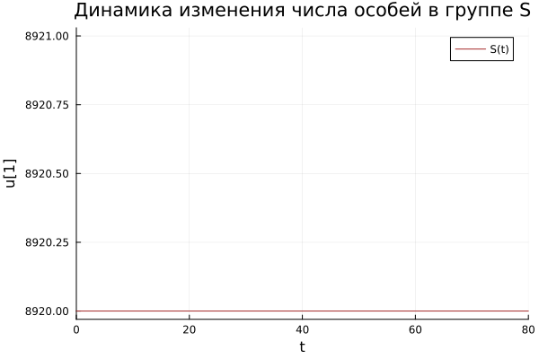
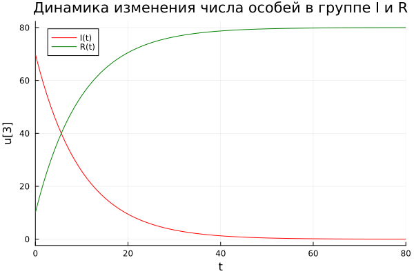
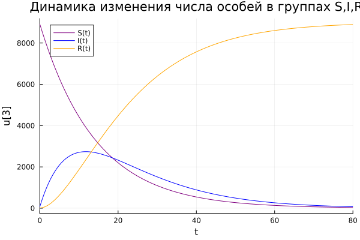
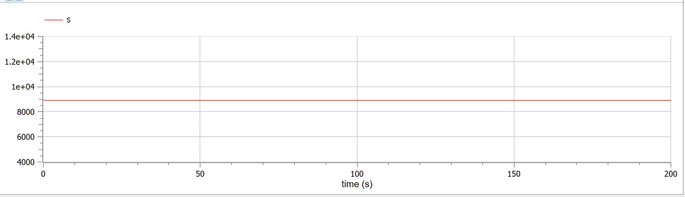
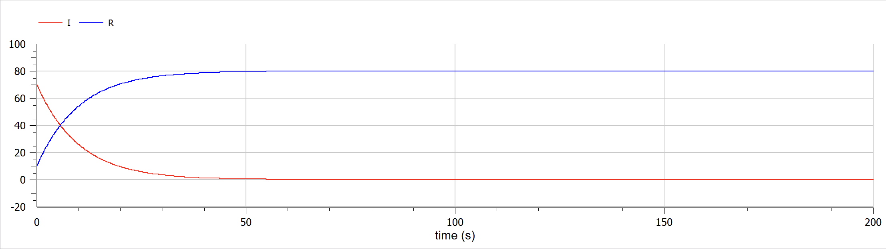
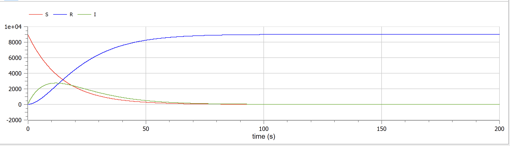

---
## Front matter
title: "Лабораторная работа №6"
subtitle: "Задача об эпидемии"
author: "Федорина Эрнест Васильевич"

## Generic otions
lang: ru-RU
toc-title: "Содержание"

## Bibliography
bibliography: bib/cite.bib
csl: pandoc/csl/gost-r-7-0-5-2008-numeric.csl

## Pdf output format
toc: true # Table of contents
toc-depth: 2
lof: true # List of figures
lot: false # List of tables
fontsize: 12pt
linestretch: 1.5
papersize: a4
documentclass: scrreprt
## I18n polyglossia
polyglossia-lang:
  name: russian
  options:
	- spelling=modern
	- babelshorthands=true
polyglossia-otherlangs:
  name: english
## I18n babel
babel-lang: russian
babel-otherlangs: english
## Fonts
mainfont: PT Serif
romanfont: PT Serif
sansfont: PT Sans
monofont: PT Mono
mainfontoptions: Ligatures=TeX
romanfontoptions: Ligatures=TeX
sansfontoptions: Ligatures=TeX,Scale=MatchLowercase
monofontoptions: Scale=MatchLowercase,Scale=0.9
## Biblatex
biblatex: true
biblio-style: "gost-numeric"
biblatexoptions:
  - parentracker=true
  - backend=biber
  - hyperref=auto
  - language=auto
  - autolang=other*
  - citestyle=gost-numeric
## Pandoc-crossref LaTeX customization
figureTitle: "Рис."
tableTitle: "Таблица"
listingTitle: "Листинг"
lofTitle: "Список иллюстраций"
lotTitle: "Список таблиц"
lolTitle: "Листинги"
## Misc options
indent: true
header-includes:
  - \usepackage{indentfirst}
  - \usepackage{float} # keep figures where there are in the text
  - \floatplacement{figure}{H} # keep figures where there are in the text
---

# Цель работы

Научиться строить базовую модель распространения эпидемии в Julia, OpenModelica

# Задание

Вариант 4

На одном острове вспыхнула эпидемия. Известно, что из всех проживающих
на острове (N=9000) в момент начала эпидемии (t=0) число заболевших людей
(являющихся распространителями инфекции) I(0)=70, А число здоровых людей с
иммунитетом к болезни R(0)=10. Таким образом, число людей восприимчивых к
болезни, но пока здоровых, в начальный момент времени S(0)=N-I(0)- R(0).
Постройте графики изменения числа особей в каждой из трех групп.
Рассмотрите, как будет протекать эпидемия в случае:

1) если I(0) <= I*
2) если I(0) > I*


# Теоретическое введение
Самой простейшей является SIR-модель (Susceptible–Infected–Removed model), в которой каждый из индивидуумов, входящих в исследуемую популяцию, может находиться в одном из трех возможных состояний: Susceptible (потенциально восприимчивый к заражению), Infected (инфицированный), Removed (выздоровевший и невосприимчивый к заражению). Предполагается, что индивидуумы могут стать невосприимчивыми к заражению только после полного извлечения от инфекции, т.е. в какие-то моменты времени для каждого возможна последовательность переходов Susceptible ® Infected ® Removed.

Основными базовыми предположениями при использовании данной модели является следующие:

– каждый из восприимчивых индивидуумов, контактирующий с инфицированным, имеет определенную вероятность заражения, независящую от времени;

– скорость заражения пропорциональная количеству инфицированных индивидуумов, а также количеству восприимчивых (действительно, чем больше у инфицированных среди всех их контактов людей восприимчивых к заражению, тем будет выше скорость заражения, но конечно при неизменном среднем количестве контактов среди всей исследуемой популяции).

– каждый инфицированный, в свою очередь, имеет постоянную вероятность выздоровления в единицу  времени;

– скорость выздоровлений пропорциональна количеству инфицированных.

Если в какой-то период времени скорость заражения оказывается выше скорости выздоровлений, это означает, что данный период характеризуется распространением эпидемии. В противном случае, можно будет говорить о том, что эпидемия затухает.

В целом, SIR-модель может позволить, по крайней мере, в первом приближении оценить примерную динамику распространения эпидемии. Но реальный процесс протекания болезней несколько сложнее, необходимо учитывать при моделировании еще ряд факторов. В первую очередь это касается того, что процесс заболевания может состоять как минимум из двух стадий: инкубационный период (без внешних признаков заболевания) и непосредственно период болезни (с наличием внешних признаков заболевания и возможной при этом изоляции инфицированного индивидуума). Кроме того могут заболевание каждого индивидуума может протекать в различных формах: в легкой (когда индивидуум может переносить болезнь в домашних условиях),  в средней (с возможной необходимостью госпитализации) и в тяжелой (на примере COVID-19 болезнь может перейти в коронавирусную пневмонию с необходимостью перевода пациентов в реанимационное отделение и применения аппаратов искусственной вентиляции легких).

Учесть первый из данных факторов позволяет SEIR-модель (Susceptible–Exposed–Infected–Removed model), являющаяся некоторой модификацией SIR-модели. В данной модели каждый индивидуум может находиться уже в одном из четырех возможных состояний. К трем рассмотренным состояниям в SIR-модели добавляется еще одно Exposed (зараженный, находящийся в инкубационном периоде). В какие-то моменты времени для каждого возможна последовательность переходов.

Реализовать данную модель можно как с применением аналитического (с составлением системы дифференциальных уравнений), так и имитационного моделирования. С учетом того, что требуется рассмотрение различных сценариев, в которых могут учитываться определенные внешние воздействия на систему, отражающие какие-то профилактические или ограничительные мероприятия, некоторые из параметров данной системы (например, частота социальных контактов) будут нестационарными. Кроме того, анализ распространения и тяжести протекания болезни при СOVID-19 за прошедший период, предполагает необходимость разделения всей исследуемой популяции на некоторые возрастные категории, т.к. по большей части у молодого населения болезнь протекала в легкой стадии. В то же время, у старшего населения очень часто болезнь протекала в тяжелой форме и заканчивалась зачастую летальным исходом. [@wiki:bash]

Наша популяция, состоящая из N особей, делится на три группы.

- S(t) — те, кто может заболеть
- I(t) — те, кто заболел и представляют опасность для остальных
- R(t) — выздоровившие особи с иммунитетом

До того, как число заболевших не превышает I считаем, что все больные были изолированы и не  больше заражают здоровых. Когда I(0)>I*, тогда инфицирование способны заражать подверженных заболеванию особей.

Скорость изменения числа S(t) меняется по следующему закону:
$$
 \frac{\partial S}{\partial t} = \begin{cases} - \alpha S, если \ I(t)>I^* \\ 0, если \ I(t) \leq I^* \end{cases}
$$
Скорость изменения числа больных особей представляет разность за единицу времени между заразившимися и теми, кто уже болеет и лечится, т.е.:
$$
 \frac{\partial I}{\partial t} = \begin{cases} \alpha S - \beta I, если \ I(t)>I^* \\  - \beta I, если \ I(t) \leq I^* \end{cases}
$$
Скорость изменения выздоравливающих особей (при этом приобретающие иммунитет к болезни)
$$
\frac{\partial R}{\partial t} = \beta I
$$
Постоянные пропорциональности:

- $$
  \alpha
  $$

   — коэффициент заболеваемости

- $$
  \beta
  $$

  — коэффициент выздоровления

Для того, чтобы решения соответствующих уравнений определялось однозначно, необходимо задать начальные условия. Считаем, что на начало эпидемии в момент времени t = 0 нет особей с иммунитетом к болезни R(0)=0, а число инфицированных и восприимчивых к болезни особей I(0) и S(0) соответственно. Для анализа картины протекания эпидемии необходимо рассмотреть два случая: I(0) > I* и I(0) <= I*.

# Выполнение лабораторной работы

## Строим модели


Для начала построим эту модель на Julia:


```
using  Plots
using DifferentialEquations
using OrdinaryDiffEq

const N = 9000
const I0 = 70
const R0 = 10
S0 = N - I0 - R0
const alpha = 0.07
const beta = 0.1

u0 = [S0, I0, R0]

P0 = (beta)

T = (0, 80)

function F0(du, u, p, t)
    beta = p
    du[1] = 0
    du[2] = -beta*u[2]
    du[3] = beta*u[2]
end

problem0 = ODEProblem(F0, u0, T, P0)
solution0 = solve(problem0, Tsit5(), dtmax=0.01)

plt0 = plot(solution0, vars=(0,1), color=:brown, label="S(t)", title="Динамика изменения числа особей в группе S", xlabel="t")
plt1 = plot(solution0, vars=(0,2), color=:red, label="I(t)", title="Динамика изменения числа особей в группе I и R", xlabel="t")
plot!(plt1, solution0, vars=(0,3), color=:green, label="R(t)")

savefig(plt0, "j11.png")
savefig(plt1, "j12.png")

P1 = (alpha, beta)


function F1(du, u, p, t)
    alpha, beta = p
    du[1] = -alpha*u[1]
    du[2] = alpha*u[1]-beta*u[2]
    du[3] = beta*u[2]
end

problem1 = ODEProblem(F1, u0, T, P1)
solution1 = solve(problem1, Tsit5(), dtmax=0.01)

plt2 = plot(solution1, vars=(0,1), color=:purple, label="S(t)", title="Динамика изменения числа особей в группах S,I,R", xlabel="t")
plot!(plt2, solution1, vars=(0,2), color=:blue, label="I(t)")
plot!(plt2, solution1, vars=(0,3), color=:orange, label="R(t)")

savefig(plt2, "j2.png")

```
### 1 случай  Julia -  I(0) <= I*

Случай, в котором все инфицированные изолированы от тех, кто может заболеть и никто новый не заражается:

Здесь всё достаточно просто: мы завели все нужные коэффициенты, начальные условия, составили систему дифф. уравнений, решили её с помощью DifferentialEquations, а потом построили графики изменения популяций групп S, I, R(рис. [-@fig:001],[-@fig:002].

{#fig:001 width=70%}

{#fig:002 width=70%}


### 2 случай Julia -  I(0) > I*

Случай, в котором все инфицированные уже не изолированы от тех, кто может заболеть и люди, подверженные заражению, постепенно заражаются:(рис. [-@fig:003].)

{#fig:003 width=70%}

Теперь давайте построим эту же модель с помощью OpenModelica.

Задаем параметры, начальные условия, определяем систему уравнений и выполняем симуляцию этой модели.

```OpenModelica
model lab6
constant Real alpha = 0.07;
constant Real beta = 0.1;
constant Real N = 9000;

Real R;
Real I;
Real S;

initial equation
R = 10;
I = 70;
S = N - I - R;

equation

der(S) = -alpha*S;
der(I) = alpha*S-beta*I;
der(R) = beta*I;

end lab6;
```
В коде представлен сразу второй случай, когда в первом достаточно просто поменять сами уравнения, по аналогии с тем, как мы это делали в Julia.

### 1 случай OpenModelica -  I(0) <= I*

В данном ПО всё ещё проще: Задаём нач. условия, записываем два дифф. уравнения, настраиваем симуляцию и запускаем её, после чего получаем два графика(рис. [-@fig:004],[-@fig:005].)

{#fig:004 width=70%}

{#fig:005 width=70%}

### 2 случай OpenModelica -  I(0) > I*

Случай, в котором все инфицированные уже не изолированы от тех, кто может заболеть и люди, подверженные заражению, постепенно заражаются:(рис. [-@fig:006].)

{#fig:003 width=70%}

Сравнивая графики, полученные в Julia и OpenModelica, разницы особой незаметно(разве что масштаб), значит мы всё сделали правильно: Во втором случае, например, люди, подверженные заражению - в динамике они болеют и их число уменьшается, значит увеличивается число инфицированных, а число особей с иммунитетом тоже увеличивается( т.к люди  выздоравливают и получают иммунитет).

# Выводы

В процессе выполнения данной лабораторной работы я построил модель развития эпидемии на языке прогаммирования Julia и посредством ПО OpenModelica, а также провел сравнительный анализ их результатов.

# Список литературы{.unnumbered}

::: {#refs}
:::
