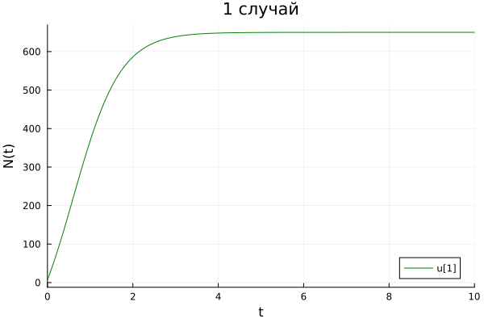
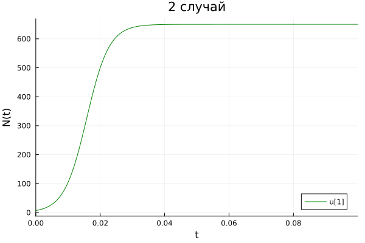
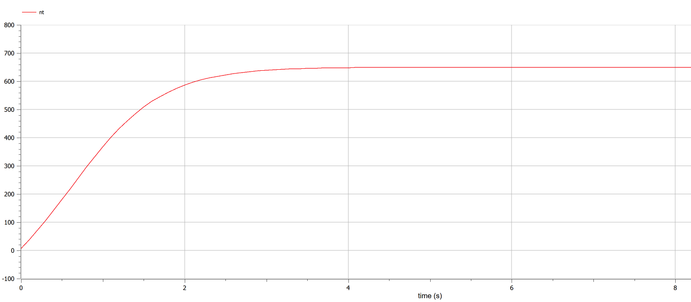
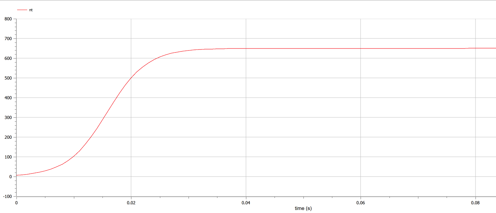
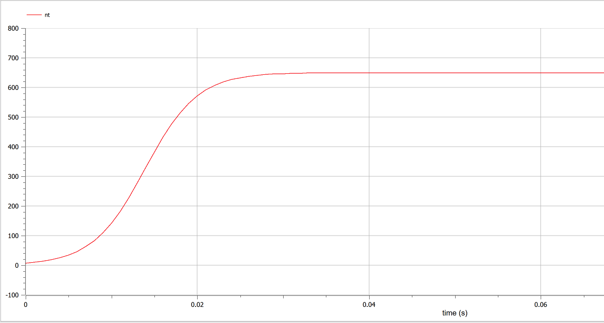

---
## Front matter
lang: ru-RU
title: Лабораторная работа №7
subtitle: Эффективность рекламы
author:
  - Федорина Эрнест Васильевич
institute:
  - Российский университет дружбы народов, Москва, Россия

## i18n babel
babel-lang: russian
babel-otherlangs: english

## Formatting pdf
toc: false
toc-title: Содержание
slide_level: 2
aspectratio: 169
section-titles: true
theme: metropolis
header-includes:
 - \metroset{progressbar=frametitle,sectionpage=progressbar,numbering=fraction}
 - '\makeatletter'
 - '\beamer@ignorenonframefalse'
 - '\makeatother'
---

# Информация

## Докладчик

:::::::::::::: {.columns align=center}
::: {.column width="70%"}

  * Федорина Эрнест Васильевич
  * студент
  * Российский университет дружбы народов
  * [1032216454@pfur.ru](mailto:1032216454@pfur.ru)
  * <https://evfedorina.github.io/ru/>

:::
::: {.column width="25%"}


:::
::::::::::::::

## Цель работы

Научиться строить базовую модель распространения рекламы в Julia, OpenModelica

## Задание

Вариант 4

Постройте график распространения рекламы, математическая модель которой описывается следующим уравнением:

1. $\frac{dn}{dt} = (0.44 + 0.0021 n(t))(N-n(t))$
2. $\frac{dn}{dt} = (0.00009 + 0.44 n(t))(N-n(t))$
3. $\frac{dn}{dt} = (0.77 t + 0.5 cos(t)n(t))(N-n(t))$

При этом объем аудитории $N = 650$, в начальный момент о товаре знает $7$ человек. Для случая 2 определите в какой момент времени скорость распространения рекламы будет иметь максимальное значение.

# Ход работы

## 1 случай  Julia -  a1 > a2

Случай, в котором знание о продукте или бренде распространяется  медленнее по сарафанному радио, нежели от рекламы для новых потенциальных клиентов:

Здесь всё достаточно просто: мы завели все нужные коэффициенты, начальные условия, составили систему дифф. уравнений, решили её с помощью DifferentialEquations, а потом построили график распространения рекламы (рис. [-@fig:001].

{#fig:001 width=70%}


## 2 случай Julia -  a1 < a2

Случай, в котором знание о продукте или бренде распространяется быстро по сарафанному радио от тех, кто уже видел рекламу или сам продукт :(рис. [-@fig:002].)

{#fig:002 width=70%}

## 3 случай Julia -  функции в коэффициентах

Случай, в котором наши коэффициенты а1 и а2 определяются в виде функций:(рис. [-@fig:003].)

{#fig:003 width=70%}

Теперь давайте построим эту же модель с помощью OpenModelica.

Задаем параметры, начальные условия, определяем систему уравнений и выполняем симуляцию этой модели.

## 1 случай OpenModelica -  a1 > a2

В данном ПО всё ещё проще: Задаём нач. условия, записываем два дифф. уравнения, настраиваем симуляцию и запускаем её, после чего получаем график(рис. [-@fig:005].)

{#fig:005 width=70%}

## 2 случай OpenModelica -  a1 < a2

{#fig:006 width=70%}

## 3 случай OpenModelica -  функции

{#fig:007 width=70%}

## Точка с наивысшей скоростью распространения рекламы в случае 2

```
v = [solution1(i, Val{1}) for i in 0:0.001:0.1]
maxim_t = findfirst(x -> x==maximum(v), v)

print(maximum(v))
print(maxim)

```
Данный кусок кода, который я показывал раннее, помогает нам найти точку во втором случае, когда скорость распространения рекламы была наивысшей. Она равнялась примерно 46439 при t = 0.017

Сравнивая графики, полученные в Julia и OpenModelica, разницы особой незаметно(разве что масштаб), значит мы всё сделали правильно.


## Сравнение графиков

Сравнивая графики, полученные в Julia и OpenModelica, разницы особой незаметно(разве что масштаб), значит мы всё сделали правильно

## Результат

В результате мы построили графики с динамикой распространения рекламы. Сравнили решения обоих ПО.

## Выводы

В процессе выполнения данной лабораторной работы я построил модель распространения рекламы на языке прогаммирования Julia и посредством ПО OpenModelica, а также провел сравнительный анализ их результатов.

## Список литературы

1. Эффективность рекламы [Статья]. URL: http://www.mediaalmanah.ru/files/56/2013_3_4_shchepiloba.pdf