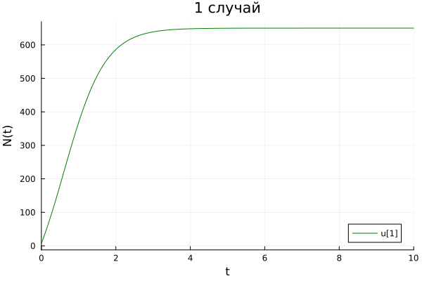
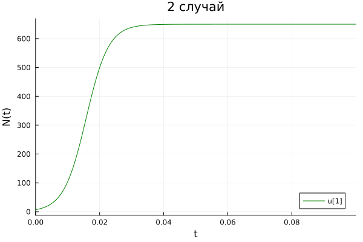
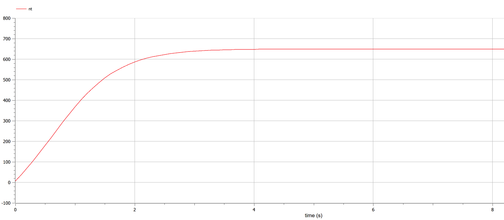
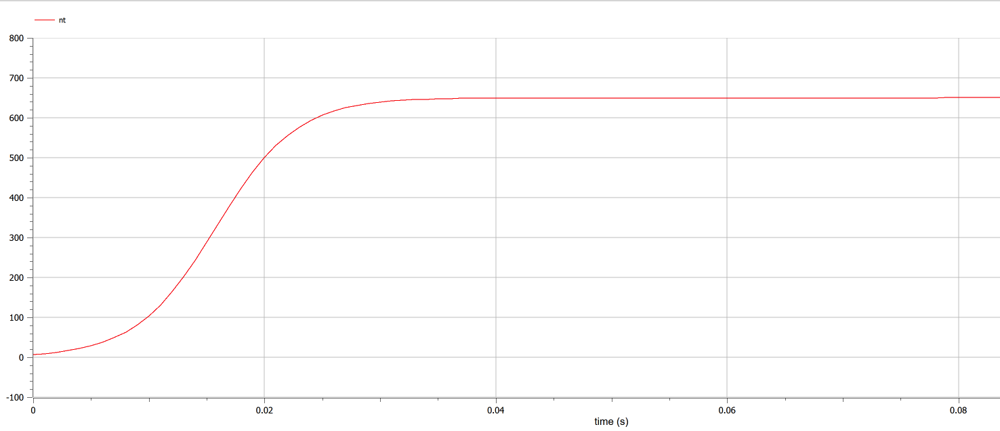
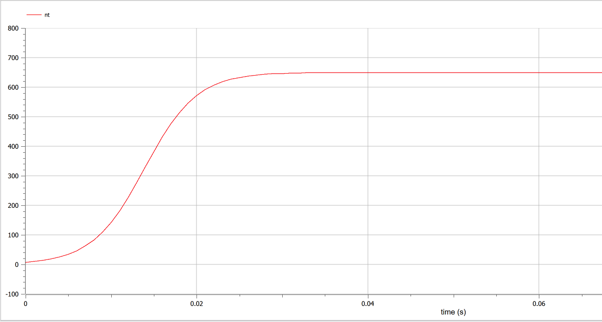

---
## Front matter
title: "Лабораторная работа №7"
subtitle: "Эффективность рекламы"
author: "Федорина Эрнест Васильевич"

## Generic otions
lang: ru-RU
toc-title: "Содержание"

## Bibliography
bibliography: bib/cite.bib
csl: pandoc/csl/gost-r-7-0-5-2008-numeric.csl

## Pdf output format
toc: true # Table of contents
toc-depth: 2
lof: true # List of figures
lot: false # List of tables
fontsize: 12pt
linestretch: 1.5
papersize: a4
documentclass: scrreprt
## I18n polyglossia
polyglossia-lang:
  name: russian
  options:
	- spelling=modern
	- babelshorthands=true
polyglossia-otherlangs:
  name: english
## I18n babel
babel-lang: russian
babel-otherlangs: english
## Fonts
mainfont: PT Serif
romanfont: PT Serif
sansfont: PT Sans
monofont: PT Mono
mainfontoptions: Ligatures=TeX
romanfontoptions: Ligatures=TeX
sansfontoptions: Ligatures=TeX,Scale=MatchLowercase
monofontoptions: Scale=MatchLowercase,Scale=0.9
## Biblatex
biblatex: true
biblio-style: "gost-numeric"
biblatexoptions:
  - parentracker=true
  - backend=biber
  - hyperref=auto
  - language=auto
  - autolang=other*
  - citestyle=gost-numeric
## Pandoc-crossref LaTeX customization
figureTitle: "Рис."
tableTitle: "Таблица"
listingTitle: "Листинг"
lofTitle: "Список иллюстраций"
lotTitle: "Список таблиц"
lolTitle: "Листинги"
## Misc options
indent: true
header-includes:
  - \usepackage{indentfirst}
  - \usepackage{float} # keep figures where there are in the text
  - \floatplacement{figure}{H} # keep figures where there are in the text
---

# Цель работы

Научиться строить базовую модель распространения рекламы в Julia, OpenModelica

# Задание

Вариант 4

Постройте график распространения рекламы, математическая модель которой описывается следующим уравнением:

1. $\frac{dn}{dt} = (0.44 + 0.0021 n(t))(N-n(t))$
2. $\frac{dn}{dt} = (0.00009 + 0.44 n(t))(N-n(t))$
3. $\frac{dn}{dt} = (0.77 t + 0.5 cos(t)n(t))(N-n(t))$

При этом объем аудитории $N = 650$, в начальный момент о товаре знает $7$ человек. Для случая 2 определите в какой момент времени скорость распространения рекламы будет иметь максимальное значение.


# Теоретическое введение

Эффективность рекламы − одна из ключевых проблем,
которая важна как для рекламодателей,
так и для средств массовой информации, выступающих
в качестве каналов распространения рекламы.
На размещение рекламы в СМИ уходит наибольшая
часть рекламного бюджета компании. Действенность
рекламы может рассматриваться
не только с коммуникативной, но и с экономической
позиций. При этом необходимо учитывать множество
факторов, связанных с рыночной ситуацией,
уровнем конкуренции в этом сегменте, ценностью
предлагаемого товара или услуги, ментальными
особенностями аудитории, а также спецификой
восприятия ею рекламных сообщений.
В статье представлены современные подходы к вопросу
об эффективности рекламы и выявлены основные
модели ее воздействия на потребителя.  [@wiki:bash]

Модель распространения рекламы описывается следующим образом
$$
\frac{\partial n}{\partial t} = (\alpha_1(t) + \alpha_2(t)n(t))(N - n(t))
$$
N - число потенциальных, платёжеспособных покупателей

n - число людей, уже узнавших о продукте

a1 - коэффициент, характеризующий интенсивность рекламы(очень зависит от затрат на рекламу)

а2 - коэффициент, характеризующий эффективность распространения рекламы по сарафанному радио( от тех, кто уже узнал о рекламе)


# Выполнение лабораторной работы

## Строим модели


Для начала построим эту модель на Julia:


```
 using Plots
 using DifferentialEquations

 const n0 = 7
 const N = 650

 const T_0 = (0, 10)

 u0 = [n0]

 # 1 случай - a1 >> a2

 function F0(du, u, p, t)
    du[1] = (0.44 + 0.0021*u[1])*(N - u[1])
 end

 P0 = ODEProblem(F0, u0, T_0)

 solution0 = solve(P0, Tsit5(), dtmax=0.1)

 plot0 = plot(solution0, color=:green, title="1 случай", xlabel="t", ylabel="N(t)")
savefig(plot0, "j1.png")

 # 2 случай - a1 << a2

 const T_1 = (0, 0.1)

 function F1(du, u, p, t)
    du[1] = (0.00009 + 0.44*u[1])*(N - u[1])
 end

 P1 = ODEProblem(F1, u0, T_1)

 solution1 = solve(P1, Tsit5(), dtmax=0.001)

v = [solution1(i, Val{1}) for i in 0:0.001:0.1]
maxim_t = findfirst(x -> x==maximum(v), v)

print(maximum(v))
print(maxim)


 plot1 = plot(solution1, color=:green, title="2 случай", xlabel="t", ylabel="N(t)")
savefig(plot1, "j2.png")

 # 3 случай - с функциями

 const T_1 = (0, 0.1)

 function F2(du, u, p, t)
    du[1] = (0.77*t + 0.5*cos(t)*u[1])*(N - u[1])
 end

 P2 = ODEProblem(F2, u0, T_1)

 solution2 = solve(P2, Tsit5(), dtmax=0.001)

 plot2 = plot(solution2, color=:green, title="3 случай", xlabel="t", ylabel="N(t)")
savefig(plot2, "j3.png")


```
### 1 случай  Julia -  a1 > a2

Случай, в котором знание о продукте или бренде распространяется  медленнее по сарафанному радио, нежели от рекламы для новых потенциальных клиентов:

Здесь всё достаточно просто: мы завели все нужные коэффициенты, начальные условия, составили систему дифф. уравнений, решили её с помощью DifferentialEquations, а потом построили график распространения рекламы (рис. [-@fig:001].

{#fig:001 width=70%}


### 2 случай Julia -  a1 < a2

Случай, в котором знание о продукте или бренде распространяется быстро по сарафанному радио от тех, кто уже видел рекламу или сам продукт :(рис. [-@fig:002].)

{#fig:002 width=70%}

### 3 случай Julia -  функции в коэффициентах

Случай, в котором наши коэффициенты а1 и а2 определяются в виде функций:(рис. [-@fig:003].)

{#fig:003 width=70%}

Теперь давайте построим эту же модель с помощью OpenModelica.

Задаем параметры, начальные условия, определяем систему уравнений и выполняем симуляцию этой модели.

```OpenModelica
model lab7
parameter Real N = 650; 
parameter Real n0 = 7; 

Real nt(start=n0);

equation

// для 1 случая
der(nt) = (0.44 + 0.0021*nt)*(N - nt);

// для 2 случая
der(nt) = (0.00009 + 0.44*nt)*(N - nt);

// для 3 случая
der(nt) = (0.77*time + 0.5*cos(time)*nt)*(N - nt);

end lab7;
```

### 1 случай OpenModelica -  a1 > a2

В данном ПО всё ещё проще: Задаём нач. условия, записываем два дифф. уравнения, настраиваем симуляцию и запускаем её, после чего получаем график(рис. [-@fig:005].)

{#fig:005 width=70%}

### 2 случай OpenModelica -  a1 < a2

{#fig:006 width=70%}

### 3 случай OpenModelica -  функции

{#fig:007 width=70%}


```v = [solution1(i, Val{1}) for i in 0:0.001:0.1]
maxim_t = findfirst(x -> x==maximum(v), v)

print(maximum(v))
print(maxim)

```
Данный кусок кода, который я показывал раннее, помогает нам найти точку во втором случае, когда скорость распространения рекламы была наивысшей. Она равнялась примерно 46439 при t = 0.017

Сравнивая графики, полученные в Julia и OpenModelica, разницы особой незаметно(разве что масштаб), значит мы всё сделали правильно.

# Выводы

В процессе выполнения данной лабораторной работы я построил модель распространения рекламы на языке прогаммирования Julia и посредством ПО OpenModelica, а также провел сравнительный анализ их результатов.

# Список литературы{.unnumbered}

::: {#refs}
:::
