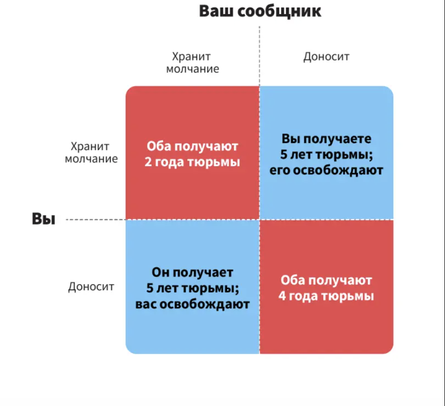

---
## Front matter
lang: ru-RU
title: Доклад
subtitle: Дилемма заключённого
author:
  - Федорина Эрнест Васильевич
institute:
  - Российский университет дружбы народов, Москва, Россия

## i18n babel
babel-lang: russian
babel-otherlangs: english

## Formatting pdf
toc: false
toc-title: Содержание
slide_level: 2
aspectratio: 169
section-titles: true
theme: metropolis
header-includes:
 - \metroset{progressbar=frametitle,sectionpage=progressbar,numbering=fraction}
 - '\makeatletter'
 - '\beamer@ignorenonframefalse'
 - '\makeatother'
---

# Информация

## Докладчик

:::::::::::::: {.columns align=center}
::: {.column width="70%"}

  * Федорина Эрнест Васильевич
  * студент
  * Российский университет дружбы народов
  * [1032216454@pfur.ru](mailto:1032216454@pfur.ru)
  * <https://evfedorina.github.io/ru/>

:::
::: {.column width="25%"}

:::
::::::::::::::

# Введение

## Цель работы

Исследовать концепцию дилеммы заключённого в теории игр, а также рассмотреть механизмы, позволяющие достигать сотрудничества в условиях, когда индивидуальная рациональность приводит к коллективно невыгодным исходам.

## Задачи

- Описать суть дилеммы заключённого и принципы модели.
- Рассмотреть условия, при которых возможно сотрудничество.
- Изучить стратегии в повторяющейся дилемме заключённого.

# Определение

Дилемма заключённого — это классическая задача теории игр, демонстрирующая, что два рациональных индивида могут не сотрудничать, даже если это в их обоюдных интересах. 

{#fig:001 width=35%}

# Принципы модели

| Выбор / Выбор | Сотрудничество (C) | Предательство (D) |
|---------------|---------------------|-------------------|
| Сотрудничество (C) | R, R | S, T |
| Предательство (D)  | T, S | P, P |

- \(R\) (Reward) – награда за взаимное сотрудничество;
- \(T\) (Temptation) – искушение предать, когда другой сотрудничает;
- \(P\) (Punishment) – наказание за взаимное предательство;
- \(S\) (Sucker's payoff) – "доход лоха", когда игрок сотрудничает, а другой предаёт.

## Условия для дилеммы заключённого:

- \(T > R > P > S\);

- \(2R > T + S\) (обеспечивает стимул к сотрудничеству в групповой динамике)

В классической дилемме заключённого условие \(T > R > P > S\) означает, что предательство является доминирующей стратегией для каждого игрока. Это приводит к парадоксу, когда оба игрока выбирают предательство и получают \(P\), хотя могли бы получить \(R\), если бы сотрудничали.

# Повторяющаяся дилемма заключённого

## Что это?

Допустим, у нас есть два игрока, А и В, играющих в дилемму заключённого 5 раундов. Рассмотрим следующие выплаты:

- \(R = 3\) (взаимное сотрудничество)
- \(T = 5\) (одностороннее предательство(выплата предателю))
- \(P = 1\) (наказание за взаимное предательство)
- \(S = 0\) (одностороннее предательство(выплата жертве))

## Стратегия "Око за око"

| Раунд | Выбор А | Выбор В | Выплата А | Выплата В |
|-------|---------|---------|-----------|-----------|
| 1     | C       | C       | 3         | 3         |
| 2     | C       | C       | 3         | 3         |
| 3     | C       | D       | 0         | 5         |
| 4     | D       | C       | 5         | 0         |
| 5     | C       | D       | 0         | 5         |

Итоговые выплаты после 5 раундов: А = 11, В = 16.

## Пример из реальной жизни: Торговые войны

| Страна 1 / Страна 2 | Сотрудничество (C) | Предательство (D) |
|-----------------|---------------------|-------------------|
| Сотрудничество (C) | Низкие тарифы, низкие тарифы | Высокие тарифы, низкие тарифы |
| Предательство (D)  | Низкие тарифы, высокие тарифы | Высокие тарифы, высокие тарифы |

- Низкие тарифы, низкие тарифы: \(R = 3\) для каждой страны (сотрудничество).
- Высокие тарифы, низкие тарифы: \(T = 5\) для страны, вводящей высокие тарифы, и \(S = 0\) для страны с низкими тарифами (предательство).
- Высокие тарифы, высокие тарифы: \(P = 1\) для обеих стран (взаимное предательство).

## Стратегия "Око за око с прощением"

Стратегия "Око за око с прощением" похожа на классический "Око за око", но с одним ключевым отличием: иногда, даже после того как оппонент предал, игрок выбирает сотрудничество. Это значит, что игрок готов прощать предательство оппонента с определённой вероятностью, чтобы стимулировать возврат к сотрудничеству. 

## Пример с числами

Рассмотрим серию из 5 раундов, где игрок А использует стратегию "Око за око с прощением", а игрок В иногда действует непредсказуемо.

| Раунд | Выбор А | Выбор В | Выплата А | Выплата В |
|-------|---------|---------|-----------|-----------|
| 1     | C       | C       | 3         | 3         |
| 2     | C       | D       | 0         | 5         |
| 3     | C       | D       | 0         | 5         | (А прощает В)
| 4     | C       | C       | 3         | 3         | (В возвращается к сотрудничеству)
| 5     | C       | C       | 3         | 3         |

Итоговые выплаты после 5 раундов: А = 9, В = 19.

## Пример из реальной жизни: Дипломатические отношения

Дипломатические отношения между странами часто следуют принципам, похожим на стратегию "Прощающего Око за око". 

{#fig:003 width=50%}

## Выводы

Дилемма заключённого является фундаментальной задачей в теории игр, показывающей сложность достижения оптимального коллективного исхода в условиях, когда индивидуальные решения приводят к коллективно невыгодному результату.

{#fig:002 width=50%}

## Список литературы

1. Дилемма заключённого [Электронный ресурс]. URL: https://ru.wikipedia.org/wiki/%D0%94%D0%B8%D0%BB%D0%B5%D0%BC%D0%BC%D0%B0_%D0%B7%D0%B0%D0%BA%D0%BB%D1%8E%D1%87%D1%91%D0%BD%D0%BD%D0%BE%D0%B3%D0%BE#:~:text=%D0%94%D0%B8%D0%BB%D0%B5%CC%81%D0%BC%D0%BC%D0%B0%20%D0%B7%D0%B0%D0%BA%D0%BB%D1%8E%D1%87%D1%91%D0%BD%D0%BD%D0%BE%D0%B3%D0%BE%20(%D0%B0%D0%BD%D0%B3%D0%BB.,%D0%B5%D1%81%D0%BB%D0%B8%20%D1%8D%D1%82%D0%BE%20%D0%B2%20%D0%B8%D1%85%20%D0%B8%D0%BD%D1%82%D0%B5%D1%80%D0%B5%D1%81%D0%B0%D1%85..